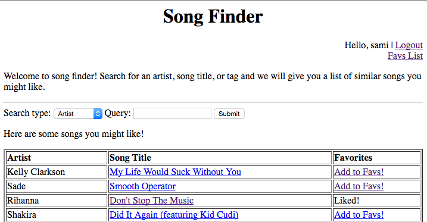

Project 4 - Persistent Storage
===============================

For this project, you will extend your previous project to use a relational database and to support user accounts and a *favorite songs* list.

## Deadlines

:warning: As noted in the syllabus, a student is only guaranteed **ONE** project submission per **WEEK**. If Project 4 *code review* is not *complete* by May 12, 2016, you will be required to submit Project 4 during the finals week and will **not** be eligible to submit Project 5.

If Project 3 *code review* is not *complete* by May 12, 2016, you will be required to submit Project 3 during the finals week and will **not** be eligible to submit Projects 4 or 5.

You are guaranteed only one code review during finals week. All code must be submitted to your git repository before your scheduled code review.

## Requirements

**Create User Account** - The main page of your site must provide a button that allows a new user to create an account. The button will take the user to a page that allows the user to fill out a profile and create the account.

  - At minimum, the profile must contain the user's full name, a username, and a password.
  - Your program must verify that the username is not already taken.
  - It would be a good idea to ask the user to enter the password twice and confirm the passwords match!

**Persistent Storage** - The user's profile information must be stored in your [mySQL database](https://github.com/CS212-S16/lectures/blob/master/notes/dbassignments.md). You will design the schema for this database table. Mine is very straightforward and has columns for the full name, the username, and the password. You are not required to hash the password.

**Login/Logout** - You will provide the option for a user to log in to use your site and log out when finished. 

  - The login page will prompt the user for a name and password.
  - Once entered, your application will verify that the password is correct. If not, it will provide appropriate feedback for the user. If so, it will allow the user to interact with your site as a registered user.
  - The user may logout from any page. This will clear the session.

**Add Song to Favorites** - If a user is logged in, allow him/her to add songs to a favorites list. A sample interface for this is below. When the search shows a set of results, I display a column indicating, for each song, whether the song is already *liked* or may be added to the favorites list. If you want to get fancier, you could use images here, like :thumbsup:.

 

**Display Favorites** - The main page will provide a link to view a list of all of the favorites the user has saved. You can see an example in the image above. For full credit, the favorites information must be stored in the database. My solution uses a table with two columns, the username and trackID. There is a row in the table for each favorite.

## Hints ##

- Encapsulate the database communication in a separate helper class with several static methods. For example, you might have a method `addUser` that takes as input a name, username, and password, constructs an appropriate INSERT statement, and uses a `PreparedStatement` object to insert the information into the database. Similarly, a method `verifyUser` might take a username and password and return true if the username and password match a row in the database, and false if not.
- Make sure to close each database connection when finished. This is a requirement, not a hint! If you forget to do this, your classmates will not like you very much because you will block others from connecting to the database.
- Make sure to do thorough error checking. Consider what happens if someone visits your page by manually typing the URL rather than visiting a link you provide. They might not provide required parameters, and your code should catch this and handle it appropriately.

# Submission 
You do **not** need to pass any unit tests for this project. You *may* remove the code that saves the `MusicLibrary` and the search output to a file.

Before you qualify for code review, we will verify that your site is up at your specified node and that it implements all of the functionality specified above. If any functionality is missing or does not work as specified above, you will need to revise your solution before code review.

Follow these instructions *carefully* in order to submit your project: [Project Guidelines](https://github.com/CS212-S16/lectures/blob/master/Notes/projectguidelines.md)
